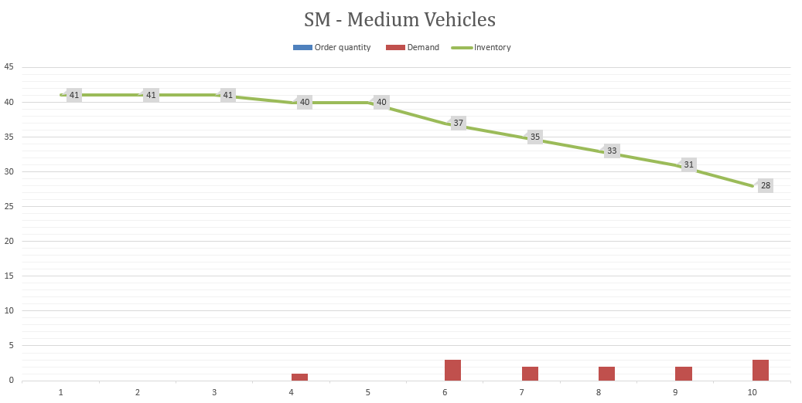

```{r global_options, include=FALSE}
knitr::opts_chunk$set(fig.pos = 'H')
```

\newpage
# Abstract
In this report, we look to develop optimized models on Demand Forecasting & Inventory Management for Caterpillar India. It is a prominent supplier for construction equipment in the Asia-Pacific region. They offer many different types of excavators, all of which could be divided into three categories based on the size of the vehicle: heavy, medium, and small. 
Recently, the company has experienced significant loss due to mismatch of inventory and demand. As it may be common in these conventional industries, they do not leverage predictive analytics to base their forecast upon but rather rely on experts’ opinions to place their order. 
Therefore, we propose using predictive models to give a more accurate forecast of the demands. The forecasting techniques that we will be using are: Moving Average, Simple Exponential, Holt’s and Croston. All these methods will be compared against each other and the Naïve Forecasting, and each vehicle category will be modeled separately, with all the aforementioned methods After developing all the models, we will identify the ones with the best (smallest) error indicators (RMSE & MAPE) and use its forecasted values as a basis to start our next major step: developing an appropriate Inventory Management system. 
The current Inventory Management system Caterpillar India use is a (R,S) system. They periodically review their inventory every month and then order the respective amount to bring it back to the targeted stock level. In our analysis, we exposed the classic limitation of R,S system that leads to overstocking and redundant ordering costs.In order to combat these problems, we propose using a Silver Meal Heuristics IM system based on the forecasted demand derived from our prior forecasting. In addition, safety stocks are also considered to deal with the forecasting errors. 
To conclude, we proved the effectiveness of the forecasts and the Silver Meal Heuristics model by showing its significantly lower cost versus the current (R,S) system. Even though assumptions were made in our model to make up for the lack of data, these models were still prove its effectiveness in a model with these fixed parameters vs the old systems. It once again confirm the value of predictive analytics over common wisdom and experts opinion, though both can co-exist and work together to best support a company’s planning. 
\newpage


# 1. Introduction
Caterpillar India (CAT) is a 100% subsidiary of an American fortune 100 corporations, Caterpillar Inc. This manufacturing facility founded in 2000 is based in Thiruvallur, Chennai, and has around 5000 employees. The company manufactures and sells products ranging from mining, transportation, captive power generation, and construction of infrastructure equipment.   

Caterpillar India Private Limited's operating revenues range is over 500M Indian Rupees (INR) for the financial year ending on 31 March 2021. It is a major player in terms of construction equipment in the Asia-Pacific region and ships machinery and equipment across several countries. Sustainability is at the center of business for CAT and is a major focus of the company. Integrity, Excellence, Teamwork, and Commitment are some of the values that CAT firmly believes in.

## Problem Statement
The company has launched new products in the excavator product category in the year 2017 for the Indian Market. The production plan for the company is based on the directives from their headquarters in the USA. The higher management also seeks expert opinions to prepare monthly production plans.   

We received the production data from the company’s ERP system for these newly launched excavators. These products have variable demand, and the company is facing the issue of inaccurate forecasting which has eventually led to deteriorating supplier relationships, inefficient cash flow management, and conflicts within the company’s departments. The inaccurate forecasting has also resulted in an undersupply and oversupply of inventory due to which the company is also incurring high inventory holding costs and shortage costs. 

## Mandate
### a) Objective
  To formulate an optimal demand forecasting and inventory management plan with a minimal cost based on the 36 months of available data.

### b) Scope of the project
For this paper, we have categorized the products into three main categories based on the size of construction vehicles - Heavy-sized, Medium-Sized, and Small-Sized vehicles. The holding costs of these vehicles vary according to their size and the data was provided at monthly aggregated levels.

This report consists of two Phases: 

  1. **Demand forecasting** 
  2. **Inventory Management**

Firstly, we noticed that there is a distinct trend in the demand patterns of the vehicles. Therefore, we decided to use time-series forecasting methods that would work well in explaining data with seasonality and trend components (Figure 1). Forecasting techniques such as Holt-Winter and Decomposition, which can capture seasonal patterns, were not considered for our analysis. This was because the vehicle sales were not showing any seasonality based on the time series plots. This was also confirmed by the company as they were also not expecting any seasonal repetition of sales by categories. 

 - Moving Average 
 - Simple Exponential
 - Holt’s 
 - Croston 


For each model, the results were evaluated by using 4 metrics of error measurements; Mean Squared Error (MSE), Root Mean Squared Error (RMSE), Mean Absolute Percentage Error (MAPE), and Theil’s U for both in-sample and out of sample datasets. The model with the best results was then be selected as the utilized tool for our Demand Forecasting part.  

The best results from the demand forecasting models were then selected to develop an Inventory Management plan that can minimize the current issues in the client’s system. We developed this inventory plan using Silver Meals Heuristic and then calculated the marginal and total profits the company can yield from each excavator model if they adopted our solution. 

# 2. Data Profile

The raw data that we received contains multiple numbers of SKUs (stock keeping units). However, most orders received are expressed in terms of vehicle sizes. Because of this, we decided to aggregate the SKUs into three categories based on size, i.e.: small, medium, and large-sized vehicles instead of considering them as individual SKUs. All the currency in this report is in Indian Rupees (INR) as the business is located in India. And we decided not to convert the currency into any other format to represent it in the original format. The data is from 2019 to 2021 and is aggregated at the monthly level.  

The Selling price of heavy, medium, and small vehicles are 9M, 7.2M, and 3.6M INR respectively. The acquisition costs of all the vehicles are assumed to be 50% of the selling price. We learned from the company that the holding costs for heavy vehicles are 13% of the acquisition cost while the annual holding costs of small and medium-sized vehicles are 10% of their respective acquisition costs. The company also incurs a penalty of double the holding costs per unit for any shortages. The company has also mentioned that the ordering cost for a batch of heavy vehicles is 1.2M INR. And those for small or medium-sized vehicles are 1M INR. 

# 3. Demand Forecasting
## Methodology

Since we have the data in monthly aggregated buckets for 36 months (about 3 years), each month is considered an individual period of input. Since some of the models that we have used in demand forecasting have parameters that needed to be optimized, we decided to split the data into in-sample and out-of-sample datasets. The dataset was divided using a rough 70-30 split, with the first 26 months belonging to the in-sample set and the remaining 10 months in the out-of-sample set. The model parameters were then trained only on the in-sample data. Then it was tested on the out-of-sample dataset to determine model predictability for the unseen periods. Model performances were then compared using the following metrics: a) Root Mean Square Error (RMSE) and b) Mean Absolute Percentage Error (MAPE).

```{r echo=FALSE, fig.cap="Sample Evaluation Rubric – Holt Model (Heavy Sized Vehicles)", fig.show="hold", fig.align="center"}

```

***1.	Naïve Forecasting:*** 

In this forecasting technique, we consider that the previous period’s sales will be used as the forecast for the next period. The main advantage of naïve forecasting is that it is quite easy to calculate, and it is not dependent on the amount of historical data. This is a good option to be considered when forecasting non-mature products (products that have just been launched). However, this technique fails to consider any of the causal relationships or time-series effects that can contribute to forecast results. 

***2.	Moving Average Forecasting:*** 

In a moving average forecasting model, the average demand from the previous k periods will be used as the next period’s forecast. This method is slightly better than the naïve method as it is not dependent on just a single period of previous demand. Because the future demand is being determined based on the aggregate demands of k previous periods, the risk or volatility of the data is pooled, which can result in better predictive outcomes.   

For the moving average, we have considered the k=3 for all categories of vehicles.

***3.	Simple Exponential:***

In a simple exponential smoothing model, we use a smoothing factor (alpha) to assign exponentially decreasing weights to periods over time. The latest periods will have the strongest weightage in contributing toward predicting the next period, whereas the earlier periods will have exponentially lower weightage. The optimal value of alpha was obtained by using the solver to minimize the RMSE values of the in-sample predictions and this was used to forecast for the out-of-sample period (27-36th weeks).  

We have observed that the Simple Exponential models were performing better than their naïve forecast counterparts for all vehicular categories based on Theil's U test (values less than 1). The models were also performing better in the out-of-sample datasets, thus confirming that we were on the right track with developing demand forecast models.
The parameters for simple exponential smoothing for all three types of vehicles are as follows

```{r echo=FALSE, fig.cap="Simple exponential smoothing parameters for all types of vehicles", fig.show="hold", fig.align="center"}

```

***4.	Holt's Model:***

From the time-series plot of the vehicle sales over time, we noticed that there is a distinct trend component in the demand pattern of small and medium vehicles. We aimed to capture this feature using the trend-based double exponential smoothing Holt model. In addition to the smoothing parameter (alpha) as in the simple exponential model, the Holt model also has a trend-based parameter (beta) which should help us get better forecast results where we noticed a distinct trend component in demand. Holt’s models were also performing better than naïve models based on Theil’s U metric; thereby confirming that it also has significant predictive power. Also, just like the previous models, we have used the in-sample data to optimize the parameters of alpha and beta to forecast for the out-of-sample periods from the 27th – to 36th weeks.
The parameters for Holt for all three types of vehicles are as follows
```{r echo=FALSE, fig.cap="Holt parameters for all types of vehicles", fig.show="hold", fig.align="center"}

```

***5.	Croston Model:***

The Croston method is an exponential smoothing model which is widely used when you want to forecast periods of intermittent demands. In our case, medium-sized vehicles had a downward trend with intermittent periods of zero demand. Other categories also had some intermittent periods but not to the same extent. However, we decided to do the Croston analysis for all three types of vehicles. 
The parameters for croston for all three types of vehicles are as follows
```{r echo=FALSE, fig.cap="Croston parameters for all types of vehicles", fig.show="hold", fig.align="center"}

```

## Results and Recommendations
Putting all the results together, the overall summary of the forecasting models for the different vehicle categories is as follows:

```{r echo=FALSE, fig.cap="Summary table for all the vehicles", fig.show="hold", fig.align="center"}
knitr::include_graphics("./Images/ResultsTable.png")
```

The reason why MAPE is giving extremely high values in medium-sized vehicles, despite relatively low RMSE values, is because there were a lot of periods with no demand in the out-of-sample dataset. This makes it difficult to calculate MAPE as percentage calculations would throw a divide by zero error.

```{r echo=FALSE, fig.cap="Heavy Vehicles – Simple Exponential Smoothing", fig.show="hold", fig.align="center", out.width="60%"}
knitr::include_graphics("./Images/3.png")
```

From the summary table, we can conclude that for heavy vehicles, simple exponential smoothing (Figure 7) was the best forecast model. Multiple exponential smoothing, Croston, and Simple Exponential models were all giving the same values (RMSE = 1.21), and this was as expected because from the line plots we had identified that the heavy vehicles were not having any distinguishable trend component and these 3 techniques are just an extension of exponential smoothing under different conditions. 

```{r echo=FALSE, fig.cap="Medium Vehicles – Simple Exponential Smoothing", fig.show="hold", fig.align="center", out.width="60%"}

```
For medium vehicles as well, Simple Exponential Smoothing gives the best result (RMSE = 0.99) on the out-of-sample dataset. This was interesting because the medium vehicle category had a lot of intermittent periods which could have justified a better result from the Croston model.

```{r echo=FALSE, fig.cap="Small Vehicles – Holt's Model", fig.show="hold", fig.align="center", out.width="60%"}

```
Holt’s model of exponential smoothing is the best forecasting model (RMSE = 2.73) for the small vehicle category, and this was also as expected because the line plots showed a noticeably clear upward trend in the demand pattern and the Holt’s model works well under this condition.  

As we all know, there are no silver bullets to predict forecasts with perfect accuracy. But using our analysis, the company can select the model that works best for their use. We would suggest using multiple approaches as proposed above and adopting the best models for implementing this project. Another improvement over the proposed solution will be to assign weights to the different forecasting techniques for combining the models to give better forecast results by optimizing to minimize the residual error.

# 4. Inventory Management
## Methodology

The company has some technological constraints that limit them to place an order whenever the reorder point is reached. Also, given the size and volume of the targeted products, suppliers impose few restrictions on the time of placing orders. Hence, the company is managing the inventory using a fixed interval variable order quantity (R, S) policy.   

Firstly, we evaluated the company’s current inventory plan to understand the benefits and limitations of its methodology. Following this, we built an inventory management plan for the complete 36 months, with a focus on the last 10 months. We then did a comparative analysis of the company’s current inventory plan with our recommended solution for this period of 10 months.

### Scenario – 1 

**Current Inventory Management System** 

For each product category, the respective target stock level (S) is calculated using the classic safety stock formula of an R, S system. Currently, the company places an order every 1 month to raise the inventory level to its maximum position S. Also, the lead time to receive the order is 1 month.  

$$ S= \mu*L + SS $$
The inventory management plan was built for the entire 36 periods based on the inputs from the company about its current system. Total costs for each period were then calculated after taking into consideration the per unit shortage costs where the demand was not fully satisfied. 

$$Total Cost= Holding Cost + Shortage Cost + Ordering Cost$$  


### Scenario - 2 

**Proposed Inventory Management System : Silver Meal Heuristics**

We developed an inventory optimization model using the forecasted demands from the predictive models as input. The forecasted demands for each product category were chosen from their respective best-performing demand forecasting models. The inventory optimization model is based on the last 10 periods of the historical data, so it matches the out-of-sample dataset from demand forecasting. In this scenario, we are considering that the company is using an R, S inventory system until the 26th period, and then optimizing their inventory using Silver-Meal Heuristic for the last 10 periods. The starting inventory for the SM heuristic model is the ending inventory of the 26th period. Safety stock was then pre-calculated by using the RMSE of the forecast model by maintaining a service level of 85%. A minimum level of inventory equal to safety stock is maintained for the entire period without being used.  
$$SS= z*(rmse)*\sqrt(R+L)$$

The Silver Meal Heuristic algorithm is used for inventory optimization of all three types of vehicles. 

```{r echo=FALSE, fig.cap="Inventory plan for Heavy Vehicles using SM Heuristics", fig.show="hold", fig.align="center", out.width="60%"}
knitr::include_graphics("./Images/7.png")
```

Orders are placed only when the inventory level (apart from safety stock) has reached zero. For heavy vehicles, only 4 orders of variable quantities are recommended over the last 10 months.  

```{r echo=FALSE, fig.cap="Inventory plan for Medium Vehicles using SM Heuristics", fig.show="hold", fig.align="center", out.width="60%"}

```

From the figure, we can observe that we recommend no orders be placed for medium vehicles over the last 10 periods. This is because a high amount of inventory was accumulated by the end of the 26th period and overall forecasted demand is very low.  As a result, the overall demand during this period will be satisfied by the initial inventory.

```{r echo=FALSE, fig.cap="Inventory plan for Small Vehicles using SM Heuristics", fig.show="hold", fig.align="center", out.width="60%"}
knitr::include_graphics("./Images/9.png")
```

7 orders of variable quantities over the last 10 months were recommended to satisfy the demand for small vehicles. 

## Results and Recommendations: 

Putting all the results together, the comparative analysis of the current scenario and our proposal for the different vehicle categories are as follows: 

```{r echo=FALSE, fig.cap="Comparartive Analysis of the Inventory Models", fig.show="hold", fig.align="center"}

```
It is important to note that the cost savings achieved through our proposed solution are highest for medium-sized vehicles.  In our recommended solution, the ordering costs for medium-sized vehicles are zero, which can result in substantial savings for the company. The inventory at the end of the 26th period will be utilized to satisfy the demand over the next 10 periods. However, in the current scenario, the company places 7 different orders to raise the inventory level to the maximum position, S, which has resulted in high ordering and inventory costs (overstocking). Our recommendation is particularly exposing the limitations of the currently practiced inventory policy (R, S) system.   

Silver Meal Heuristic never leads to shortages or lost sales which is evident from the cost savings of the small vehicle inventory optimization model. Overall, our recommended solution leads to cost savings on all three fronts (Holding Cost, Ordering Cost, and Shortage cost) for all three types of vehicles, resulting in a total cost savings of around 15.5M INR.

# 5. Conclusion

In conclusion, we found that using optimal demand forecasting and inventory management techniques can provide huge overall benefits to the company.  From the demand analysis and forecasting, we found that simple exponential smoothing is the best forecasting technique for heavy and medium vehicles. While for small vehicles that exhibit a strong upward trend, Holt's model is the best. We then used the demands predicted by these best models to optimize the inventory for the next periods. Finally, we did a comparative analysis of the company’s current methods against our recommended solutions. We understood that our solution can result in a significant cost advantage for the company, and can greatly assist their decision-making process.   

For our analysis, we assumed that the acquisition cost will be 50% of the selling price. This acquisition cost was the basis of calculating holding costs which was used in inventory optimization. Our results can significantly vary if these assumptions are out of place. Moreover, we had no information regarding the capacity of the warehouse, hence we did not consider capacity constraints while optimizing inventory. Results can be significantly affected if these constraints are put in place. Raw material data was also not available; hence we could not provide the company with a more robust analysis in terms of Material planning (MPS), Bill of materials, etc. which could have provided the company with a greater benefit in terms of finance and efficiency. 

Despite these limitations, our study is a great reference for the company, if they wish to implement these techniques in the future to make their supply chain more resilient.

\newpage
# 6. Appendix

## Demand Forecasting

**Appendix A: Heavy Vehicles-Best Forecasting Model**
```{r echo=FALSE,fig.show="hold", fig.align="center"}

```
\newpage
**Appendix B: Medium Vehicles-Best Forecasting Model**
```{r echo=FALSE, fig.show="hold", fig.align="center"}

```
\newpage
**Appendix C: Small Vehicles-Best Forecasting Model**

```{r echo=FALSE,fig.show="hold", fig.align="center"}

```

**Appendix D: Forecast Comparison**

```{r echo=FALSE,fig.show="hold", fig.align="center"}

```
\newpage
## Inventory Management 

**Appendix E: Heavy Vehicles-RS Inventory Policy**

```{r echo=FALSE,fig.show="hold", fig.align="center"}

```

**Appendix F: Heavy Vehicles-Silver Meals Heuristics**

```{r echo=FALSE,fig.show="hold", fig.align="center"}

```
\newpage
**Appendix G: Comparative Analysis-Inventory Policy**
```{r echo=FALSE,fig.show="hold", fig.align="center"}

```